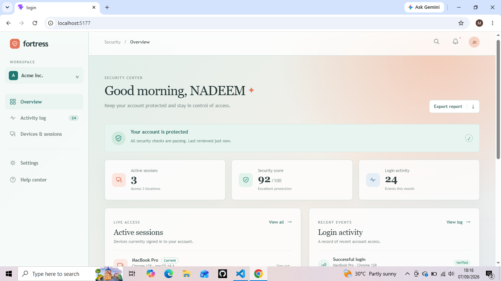
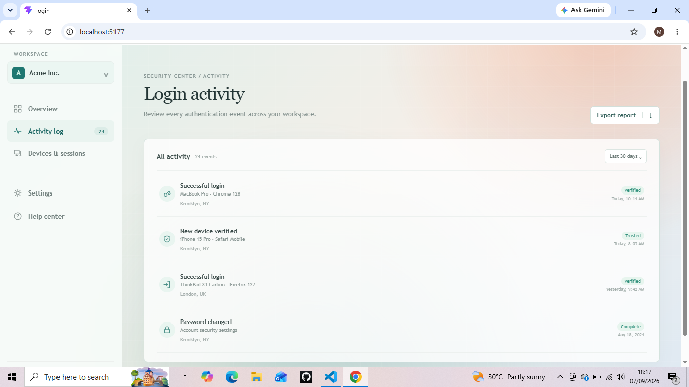
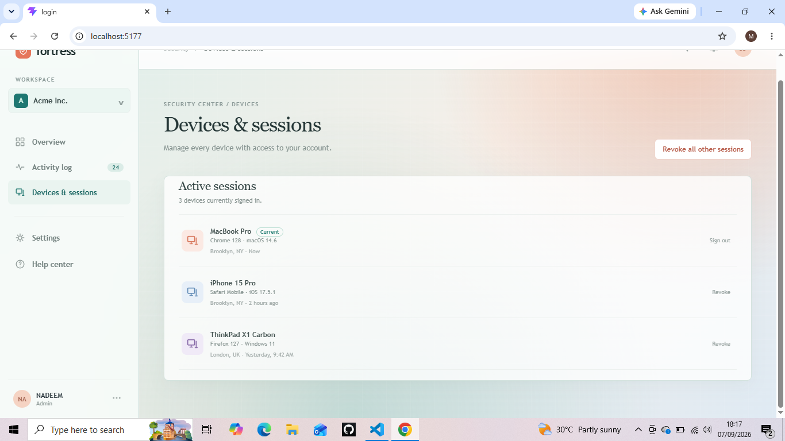
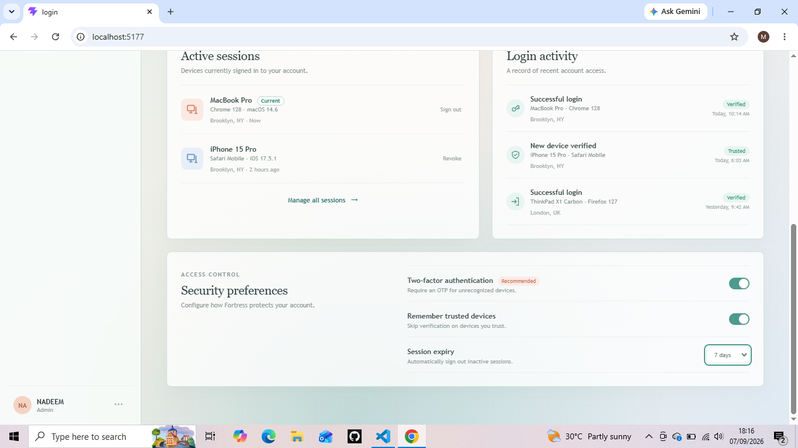

# Fortress Security Dashboard

Fortress is a responsive React dashboard for monitoring account security, login activity, and active device sessions.

## Features

- Security overview with account protection status and security metrics
- Active device and session list
- Individual session revocation and sign-out actions
- Activity log for recent login and security events
- Two-factor authentication preference toggle
- Trusted-device preference toggle
- Configurable inactive-session expiry selection
- Responsive navigation for desktop, tablet, and mobile screens
- Accessible buttons, switches, select controls, and visible keyboard focus states
- Toast feedback for user actions

## Tech Stack

- React 19
- Vite
- JavaScript and JSX
- CSS with responsive media queries
- ESLint

## Getting Started

### Requirements

- Node.js 18 or newer
- npm

### Install dependencies

```bash
npm install
```

### Start the development server

```bash
npm run dev
```

Vite prints the local URL in the terminal. If port `5173` is already in use, Vite selects the next available port.

### Build for production

```bash
npm run build
```

### Preview the production build

```bash
npm run preview
```

### Run lint checks

```bash
npm run lint
```

## Project Structure

```text
SCREENSHOTS/
  HOME.png       Overview dashboard
  ACTIVITY.png   Login activity view
  SESSIONS.png   Devices and sessions view
  FOOTER.png     Dashboard footer view

src/
  App.jsx       Main dashboard UI and local interaction state
  App.css       Dashboard layout, components, theme, and responsive styles
  index.css     Global document styles
  main.jsx      React entry point
  assets/       Static image assets
```

## Screenshots

### Overview



### Login Activity



### Devices and Sessions



### Footer



## Demo Data

The current interface uses local in-memory demo data. Session revocation, preference toggles, navigation, and toast messages work during the current browser session, but data is reset when the page reloads.

## Production Authentication Requirements

This frontend is a UI prototype and does not yet provide a real authentication backend. A production implementation should add:

- Server-side session storage with hashed, rotating session tokens
- Secure, `HttpOnly`, `Secure`, and `SameSite` cookies
- Server-side session invalidation and inactivity expiry
- Device and browser fingerprint handling without relying on untrusted client values
- IP address and approximate location lookup with privacy controls
- OTP generation, rate limiting, expiry, and delivery through an email or authenticator provider
- Trusted-device tokens with revocation and bounded lifetimes
- Login notification emails for new devices
- Authorization checks for administrator activity-log access
- Audit-log retention, redaction, and monitoring policies

Never treat the demo data or client-side state as an authentication boundary.
